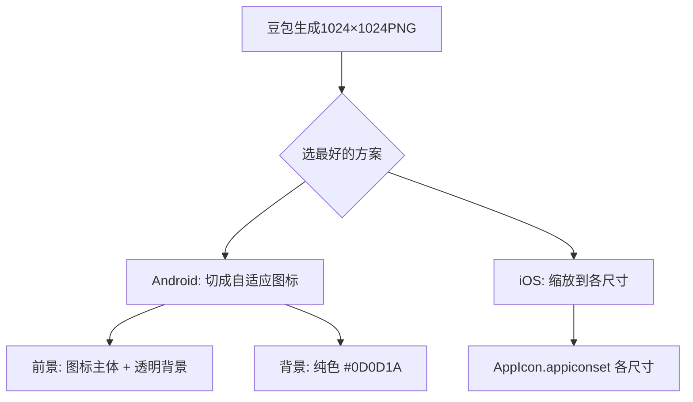

# HabitForge · 豆包 App 图标生成提示词

> 目标：用豆包生成应用图标（Launcher Icon），同时适配 Android 和 iOS。
> 输出用途：直接替换 `habit-forge-app/android/app/src/main/res/` 各密度目录下的 `ic_launcher.png`，
> 以及 `habit-forge-app/ios/Runner/Assets.xcassets/AppIcon.appiconset/` 中的各尺寸图标。

---

## 一、设计规范

### 统一约束

```
- 风格：Q 版可爱、暗黑奇幻、紫金配色
- 元素：一个萌系铁砧（forge anvil）或锤子 + 星星，或 Q 版角色剪影 + 字母 "F"
- 形状：不要圆角背景，不要白色圆角方块，让系统自动裁切（Android Adaptive Icon + iOS mask）
- 颜色：主色深紫 #6C5CE7、高光金 #FFD700、背景深暗色 #0D0D1A
- 细节：简洁，不要复杂背景，图标的细节在小尺寸下必须清晰
- 分层：Android 需要前景（foreground）+ 背景（background）分离
```

### 平台差异

| 平台        | 要求                                                          |
| ----------- | ------------------------------------------------------------- |
| **Android** | Adaptive Icon：前景 108×108（透明背景），背景 108×108（纯色） |
| **iOS**     | 1024×1024 正方形，无透明区域，无圆角（苹果自动打圆角）        |

**豆包输出：** 生成 **1 张 1024×1024 正方形图**，带透明背景的纯图标即可。
从这张大图可以缩放出所有平台所需尺寸。

---

## 二、提示词

### 2.1 主推方案 — 铁砧 + 星星（推荐）

```
移动应用图标，暗黑奇幻RPG风格，
萌系 Q版金色铁砧，铁砧上方有一颗闪烁的紫色星星，
深紫色到黑色渐变椭圆背景，铁砧周围有金色光晕，
整体简洁干净，细节在小图标尺寸也清晰可见，
正方形构图，1024x1024，高清，不要文字，
不要圆角，不要边框，纯图标，png格式
```

### 2.2 备选方案 — 字母 F 风格化

```
移动应用图标，暗黑奇幻RPG风格，
一个风格化的粗体字母F，F设计成一把剑或法杖的形状，
颜色为紫色渐变 #6C5CE7 到 #A78BFA，带金色描边，
深色圆形或圆角方形背景 #0D0D1A，
整体简约、高端、辨识度高，
正方形构图，1024x1024，高清，不要其他文字，
不要圆角，纯图标，png格式
```

### 2.3 备选方案 — Q 版角色头像

```
移动应用图标，暗黑奇幻RPG风格，
一个Q版萌系法师/战士头像，超大眼睛，圆圆脸，
深紫色巫师帽或头盔，金色星星装饰，
深色背景，头像周围有紫色金色光晕，
整体可爱但有辨识度，细节在小尺寸下清晰，
正方形构图，1024x1024，高清，不要文字，png格式
```

---

## 三、生成 & 导出工作流



### Android 图标尺寸

豆包图片导出后，用任何图片工具切出：

| 目录                 | 尺寸              | 说明            |
| -------------------- | ----------------- | --------------- |
| `mipmap-mdpi/`       | 48×48             | 前景 + 背景分开 |
| `mipmap-hdpi/`       | 72×72             |                 |
| `mipmap-xhdpi/`      | 96×96             |                 |
| `mipmap-xxhdpi/`     | 144×144           |                 |
| `mipmap-xxxhdpi/`    | 192×192           |                 |
| `mipmap-anydpi-v26/` | Adaptive Icon XML | 引用前景/背景   |

### iOS 图标尺寸

| 文件名                          | 尺寸              |
| ------------------------------- | ----------------- |
| `Icon-App-20x20@1x.png` ~ `@3x` | 20 / 40 / 60      |
| `Icon-App-29x29@1x.png` ~ `@3x` | 29 / 58 / 87      |
| `Icon-App-40x40@1x.png` ~ `@3x` | 40 / 80 / 120     |
| `Icon-App-60x60@2x.png` ~ `@3x` | 120 / 180         |
| `Icon-App-1024x1024@1x.png`     | 1024（App Store） |

---

## 四、快捷命令

### 生成所有尺寸（macOS，用 `sips` 自带工具）

```bash
# 从豆包导出的原图（假设为 app-icon.png）生成所有 Android 尺寸
for size in 48 72 96 144 192; do
  mkdir -p android/app/src/main/res/mipmap-${size}dpi
  sips -z $size $size app-icon.png \
    --out android/app/src/main/res/mipmap-${size}dpi/ic_launcher.png
done

# 生成 iOS 尺寸
for size in 20 29 40 60; do
  sips -z $size $size app-icon.png \
    --out ios/Runner/Assets.xcassets/AppIcon.appiconset/Icon-App-${size}x${size}@1x.png
  sips -z $(($size * 2)) $(($size * 2)) app-icon.png \
    --out ios/Runner/Assets.xcassets/AppIcon.appiconset/Icon-App-${size}x${size}@2x.png
  if [ $size -ne 60 ]; then
    sips -z $(($size * 3)) $(($size * 3)) app-icon.png \
      --out ios/Runner/Assets.xcassets/AppIcon.appiconset/Icon-App-${size}x${size}@3x.png
  fi
done

# 1024 App Store
sips -z 1024 1024 app-icon.png \
  --out ios/Runner/Assets.xcassets/AppIcon.appiconset/Icon-App-1024x1024@1x.png
```

### 更新 Flutter 配置

```yaml
# pubspec.yaml 不需要改 — Android/iOS 图标走原生配置
# 替换文件后 clean + rebuild 即可
```

```bash
flutter clean
flutter pub get
flutter run
```
