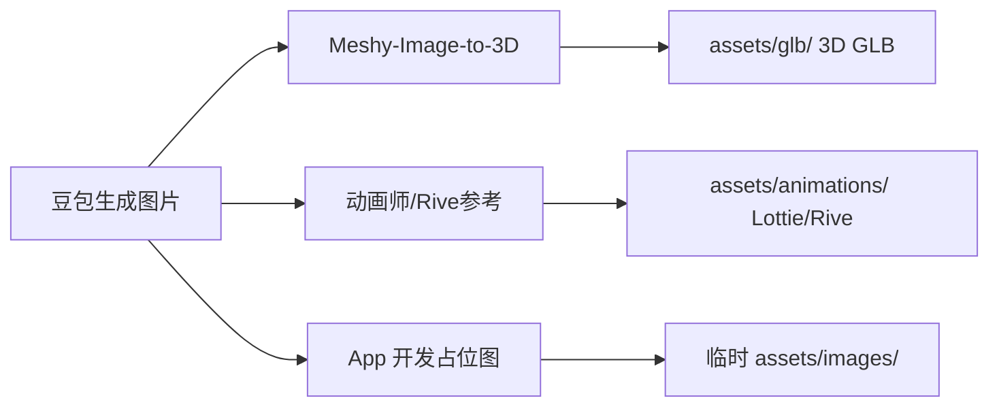

# HabitForge · 豆包图片生成提示词

> 目标：用豆包生成 **3 职业角色概念图**，作为以下用途的输入：
>
> 1. **Meshy Image to 3D** → 生成 3D GLB 模型
> 2. **动画参考** → 给 Rive/Lottie 制作 2D 动画
> 3. **UI 占位** → APP 开发过程中先用图片代替动画
>
> 风格：**半头身 Q 版（头身比 ≈1:1）、暗黑奇幻主题、紫金配色、中性角色（不区分布性别，用装备识别职业）**

---

## 设计原则：用装备识别职业，不用性别

```
每个职业的 silhouette（剪影）必须能在 50px 高度下辨认：
  Warrior ▧ — 矩形宽体，板甲垫肩 + 全闭面甲 + 大盾/剑
  Mage    ▩ — A 字梯形，阔袖长袍 + 宽松兜帽 + 高法杖
  Ranger  ▰ — 菱形窄体，贴身锁甲 + 短披风 + 弓

性别特征处理：
  - 全覆盖装备（面甲/兜帽/围巾遮挡面部和颈部）
  - 共用一套身体骨架，仅装备外轮廓创造视觉差异
  - 手部为中性大小，不区分纤细/粗壮
  - 肤色用中性色调（非刻意小麦色或粉色）
  - 用户第一眼反应：'那个拿弓的' → 不是 '那个女的'
```

---

## 使用流程



---

## 一、角色设计规范（所有角色通用）

### 设计约束

```
- 比例：头身比 ≈1:1（头略大于躯干），2头身比例，头比肩宽
- 面部：全覆盖（面甲/兜帽/护目镜），仅露眼部或完全不露
- 身体：短粗圆柱躯干、短圆四肢、手脚圆润
- 装备：全覆盖，不暴露身体线条（不区分胸腰胯）
- 配色：主色深紫 #6C5CE7、辅色金 #FFD700、纯白色背景 #0D0D1A
- 轮廓：粗黑描边，日式动漫画风，剪影可辨识
- 光影：赛璐珞平涂或轻度渐变，不要写实阴影
- 角度：正面全身，站姿持武器
- 背景：纯色深色（#0D0D1A），不要场景
```

### 豆包模式 & 参数建议

| 项       | 建议                                                   |
| -------- | ------------------------------------------------------ |
| 图片比例 | **1:1 或 3:4**（Meshy Image to 3D 需要正面清晰全身）   |
| 风格     | 插画 / 动漫 / 二次元                                   |
| 分辨率   | 高清（至少 1024×1024，保留细节供 Meshy 参考）          |
| 生成张数 | 每个角色生成 3-5 张，选最好的一张作为 Image to 3D 输入 |

---

## 二、豆包提示词

### 2.1 Warrior 战士 — 剪影 ▧ 矩形

关键特征：全闭面甲头盔 + 板甲宽肩 + 大剑/盾牌

```
Q版战士角色设计图，暗黑奇幻风格，正面全身立绘，
2头身比例，大头小身体，圆润短粗四肢，
全覆盖板甲，全封闭面甲头盔不露脸，宽大金属垫肩，
手持一把与他身高等高的巨剑，另一手持盾牌，
深紫色和金色铠甲配色，粗黑线描边，动漫风格，
纯白色背景，高清，全身站姿
```

### 2.2 Mage 法师 — 剪影 ▩ A字梯形

关键特征：尖顶宽檐帽/深兜帽 + 阔袖长袍遮全身 + 高法杖

```
Q版法师角色设计图，暗黑奇幻风格，正面全身立绘，
2头身比例，大头小身体，圆润短粗四肢，
深紫色星纹魔法长袍完全遮盖身体，超大的尖顶宽檐帽遮住大半张脸，
只露出眼睛区域的光点，长袍宽袖到地不露脚，
手持一根比他高的法杖，法杖顶端发光，
金色和深紫色配色，粗黑线描边，动漫风格，
纯白色背景，高清，全身站姿
```

### 2.3 Ranger 游侠 — 剪影 ▰ 菱形

关键特征：兜帽+围巾遮住口鼻 + 贴身锁甲 + 长弓

```
Q版游侠角色设计图，暗黑奇幻风格，正面全身立绘，
2头身比例，大头小身体，圆润短粗四肢，
深绿色和金色轻甲，深兜帽遮住额头和眼睛，围巾遮住口鼻部分，
贴身短披风，背后背着一把跟他一样高的长弓，
腰佩箭袋，小短手握着弓，
深绿色和金色配色，粗黑线描边，动漫风格，
纯白色背景，高清，全身站姿
```

---

## 三、Meshy Image to 3D 参数

豆包生成的图片经过挑选后，上传到 Meshy：

| 项                 | 建议                                                                    |
| ------------------ | ----------------------------------------------------------------------- |
| 模式               | **Image to 3D**                                                         |
| Style              | **Stylized**（不要选 Realistic）                                        |
| 纹理               | PBR 1K                                                                  |
| 导出               | GLB                                                                     |
| 提示词（可选输入） | 视情况补一句 `"chibi 2-head proportion, cute collectible figure style"` |

---

## 四、2D 动画制作参考

豆包图片也可以作为 **Rive** 或 **LottieFiles AI Creator** 的视觉参考：

- 上传豆包图片 → LottieFiles AI Creator 的 **Image to Animation** 功能（如果支持）
- 或交给动画师作为角色设定图（character sheet）
- 或直接作为 App 占位图，暂时替代 Lottie 动画，路径 `assets/images/characters/`

```dart
// 占位图使用
Image.asset('assets/images/characters/warrior.png')

// 等 Lottie/Rive 动画就绪后，一行替换
Lottie.asset('assets/animations/character_idle.json')
```

---

## 五、全部角色清单

| 角色    | 剪影形状 | 关键遮挡              | 豆包输出    | 最终文件              |
| ------- | -------- | --------------------- | ----------- | --------------------- |
| Warrior | ▧ 矩形   | 全闭面甲、板甲全身    | warrior.png | character_warrior.glb |
| Mage    | ▩ 梯形   | 深兜帽/尖帽、宽袍全身 | mage.png    | character_mage.glb    |
| Ranger  | ▰ 菱形   | 兜帽+围巾、披风遮挡   | ranger.png  | character_ranger.glb  |

**建议顺序：** 先只做 Warrior 一个角色验证流程。豆包 → Meshy Image to 3D → 导入 Flutter 跑通 → 确认效果满意 → 再批量做剩下 2 个。
